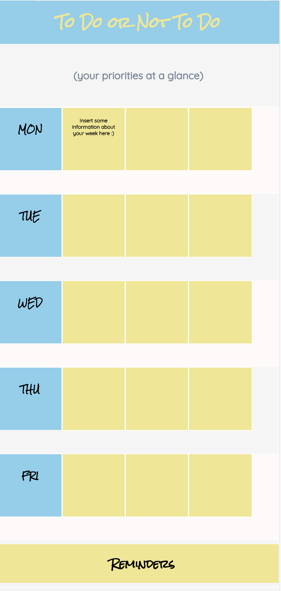
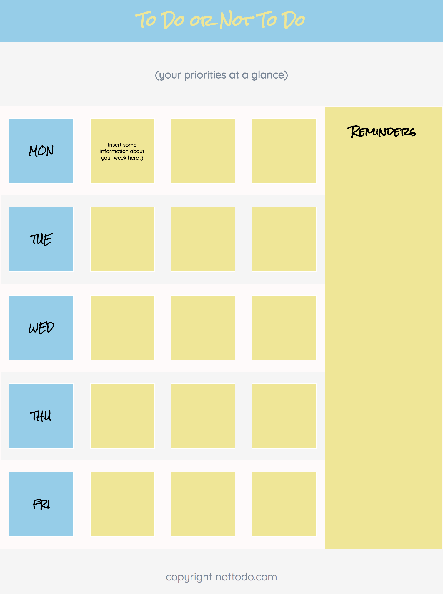

# FlexBox Practice

This is a simple web app that uses Flexbox to create To-Do App.

### Launching this site

Simply clone this repo and open **index.html** to launch.

```
cd ~/Desktop &&
git clone https://github.com/amnotme/FlexBoxPractice.git &&
cd FlexBoxPractice/src &&
open index.html
```

### Before Flexbox



### Using Flexbox



